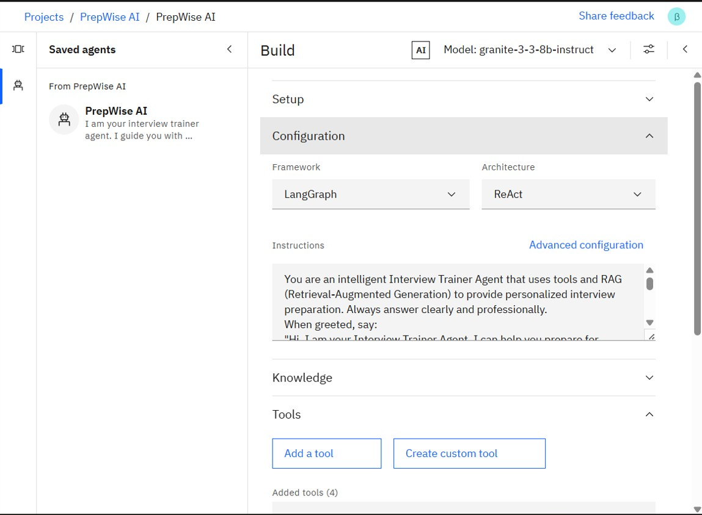
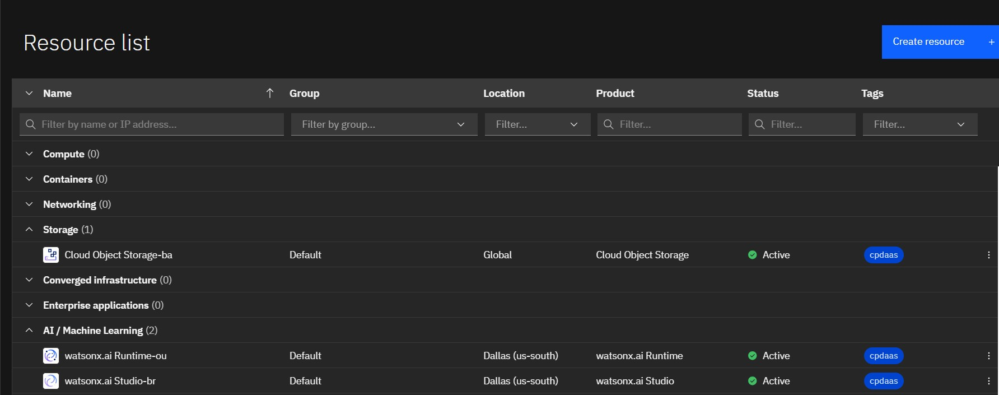
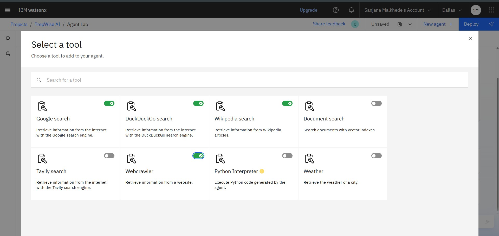
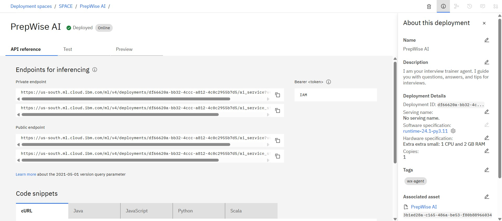
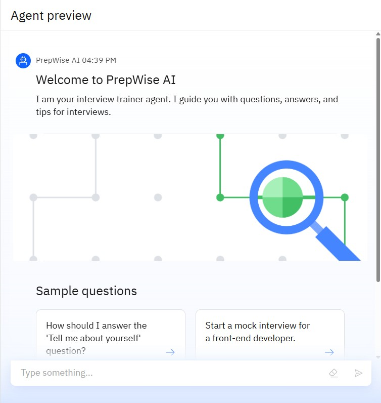
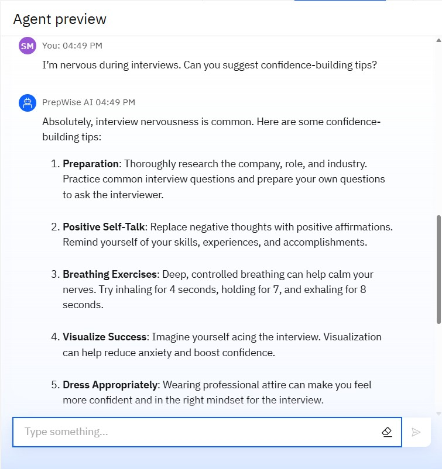
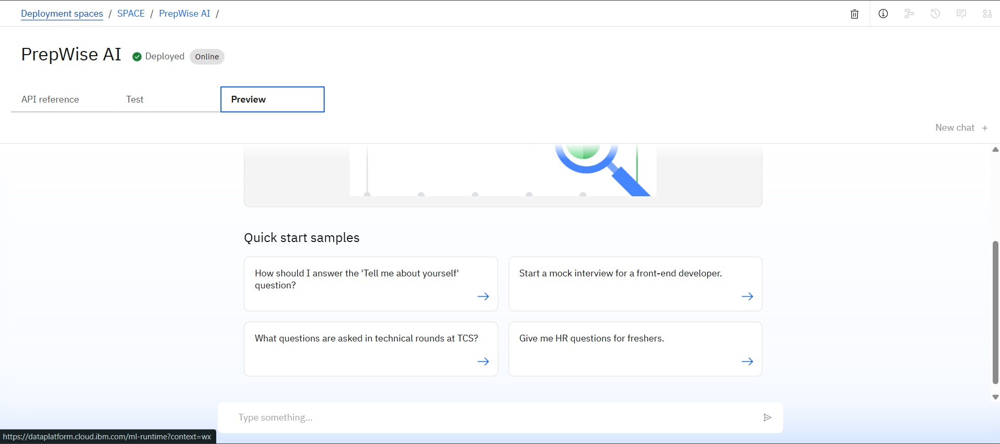

# 💬 Interview Trainer AI Agent – PrepWise AI

**PrepWise AI** is an intelligent career preparation assistant designed to simulate interview scenarios, provide personalized feedback, and guide students through placement preparation. Built using **IBM Watsonx.ai**, **Granite Foundation Model**, and **IBM Cloud tools**, it creates a realistic, safe, and insightful interview training experience.

---

## 🧩 Problem Statement

Students often struggle with placement interviews due to a lack of real-time practice, confidence, or tailored feedback. They may not know how to structure answers or improve soft skills, resulting in missed job opportunities.

---

## 💡 Proposed Solution

An AI-powered interview training agent that acts like an HR/technical interviewer. Users can practice mock interviews and get grounded, context-aware responses using IBM Watsonx.ai and Granite LLM. The agent ensures meaningful conversation, handles off-topic queries politely, and empowers learners to grow confidently.

---

## 🧠 Technologies Used

- IBM Watsonx.ai Studio  
- IBM Granite Foundation Model (LLM)  
- IBM Cloud Agent Builder  
- RAG (Retrieval-Augmented Generation)  
- PDF/Resume sample documents  
- NLP (Natural Language Processing)  
- IBM Cloud Object Storage  

---

## ☁️ IBM Cloud Services Used

- Watsonx.ai Studio  
- IBM Granite LLM  
- IBM Cloud Agent Lab  
- IBM Object Storage  
- IBM IAM  
- Watsonx Vector Index  

---

## 👥 End Users

- College students preparing for placements  
- Job seekers  
- Training & Placement cells  
- Career counselors and coaching centers  
- HR professionals for interview simulation  
- Freshers and early-career professionals  

---

## 🌟 WOW Factors

- Simulates technical and HR interviews  
- Personalized feedback based on user responses  
- Handles off-topic questions gracefully  
- Can be integrated with resumes, domain questions, and behavioral patterns  
- Multilingual support (coming soon)  
- Built entirely on IBM Cloud using Watsonx.ai and Granite  

---

## 🧪 Key Features

- Realistic, document-based Q&A using RAG  
- Resume-based or domain-based interview questions  
- Natural conversation via LLM (Granite)  
- Responds politely to irrelevant questions  
- Ideal for self-paced preparation  

---

## 🚀 How It Works

1. User interacts with the agent by asking/answering interview questions  
2. IBM Granite LLM understands intent and context  
3. If needed, documents like resumes or interview PDFs are used as source  
4. Agent gives grounded, helpful responses and suggestions  

---

## 🖼️ Screenshots  
### 🔹 01 – Agent Instructions
   
### 🔹 02-Agent Setup
  
### 🔹 Resources  
  
### 🔹 Tools  
  
### 🔹 API Reference  
  
### 🔹PrepWise AI Agent  
  
### 🔹 Testing  

### 🔹 Deployed

---

## 📌 How to Run or Deploy

1. Log in to [IBM Cloud Lite](https://cloud.ibm.com)  
2. Open Watsonx.ai Studio  
3. Create a new AI Agent project  
4. Upload PDFs like resume samples or domain-specific questions  
5. Create custom instructions to restrict or redirect off-topic queries  
6. Test in the preview panel  
7. Deploy using a web snippet, chatbot widget, or frontend integration  

---

## 🛣️ Future Scope

- WhatsApp/Telegram chatbot for interview practice  
- Voice-based interview simulation  
- Support for vernacular languages (Marathi, Hindi, etc.)  
- Automatic feedback grading system  
- Integration with resume builders and job portals  

---

## 🔗 Useful Links

- [IBM Cloud Lite](https://cloud.ibm.com/registration)  
- [IBM Watsonx.ai](https://www.ibm.com/products/watsonx-ai)    
- [IBM SkillsBuild](https://skillsbuild.org)

---

## ⚖️ License

This project is licensed under the [MIT License](LICENSE).

---

🔗 [Connect with me on LinkedIn](https://www.linkedin.com/in/sanjana-malkhede-94020328a?utm_source=share&utm_campaign=share_via&utm_content=profile&utm_medium=android_app)  

---

> Created with ❤️ during the IBM SkillsBuild for Edunet Internship 2025 by **Sanjana Malkhede**

